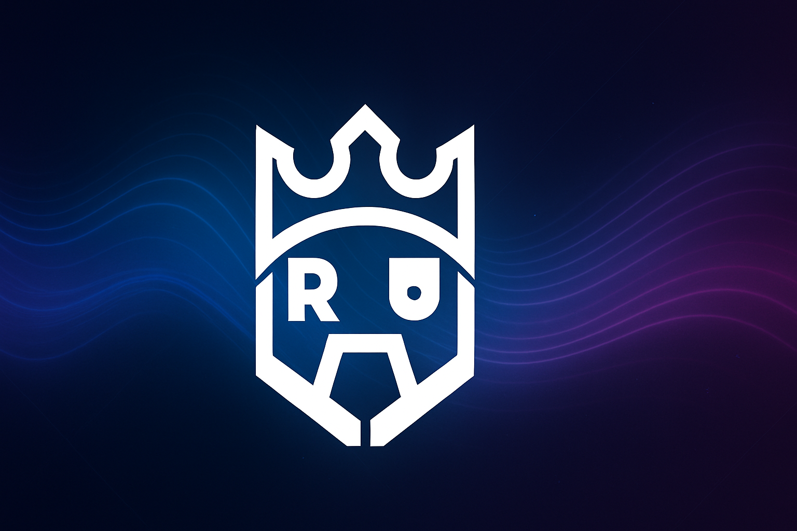

# 🎵 Hasan Arthur Altuntaş - Görsel ve SEO Rehberi

## 📋 Entegre Edilen Logolar

### ✅ Eklenen Logo Dosyaları:
1. **`assets/images/logo-light.svg`** - Beyaz logo (koyu arka planlar için)
2. **`assets/images/logo-dark.svg`** - Siyah logo (açık arka planlar için) 
3. **`assets/images/favicon.ico`** - Kompakt favicon versiyonu

### 🔗 Logo Entegrasyon Noktaları:
- **Navbar Logo**: `logo-light.svg` kullanılıyor (32x32px)
- **Footer Logo**: `logo-light.svg` kullanılıyor (40x40px)
- **Favicon**: `logo-dark.svg` ana favicon, `favicon.ico` fallback
- **Apple Touch Icon**: `logo-light.svg` kullanılıyor

---

## 🎨 Eksik Görseller ve Gereksinimleri

### 🚨 Kritik Öncelikli Görseller:

#### 1. **Hero Background Image**
- **Dosya Adı**: `hero-musician-bg.jpg`
- **Konum**: `assets/images/`
- **Boyutlar**: 1920x1080px (Full HD)
- **Format**: JPG (optimize edilmiş)
- **Prompt**: "Professional musician in recording studio, dark cinematic lighting, piano and music equipment in background, moody atmosphere, high quality photography"
- **SEO Alt Text**: "Hasan Arthur Altuntaş profesyonel müzik stüdyosunda"

#### 2. **Artist Profile Photo**
- **Dosya Adı**: `hasan-arthur-profile.jpg`
- **Konum**: `assets/images/`
- **Boyutlar**: 800x800px (kare format)
- **Format**: JPG (optimize edilmiş)
- **Prompt**: "Professional headshot of male musician and producer, confident expression, studio lighting, clean background"
- **SEO Alt Text**: "Hasan Arthur Altuntaş profesyonel profil fotoğrafı"

#### 3. **About Section Background**
- **Dosya Adı**: `about-bg-texture.jpg`
- **Konum**: `assets/images/`
- **Boyutlar**: 1200x800px
- **Format**: JPG (subtle texture)
- **Prompt**: "Abstract music-themed background, subtle notes pattern, dark purple gradient, elegant texture"
- **SEO Alt Text**: "Müzik temalı arka plan görseli"

#### 4. **Open Graph Image (Social Media)**
- **Dosya Adı**: `og-image.jpg`
- **Konum**: `assets/images/`
- **Boyutlar**: 1200x630px (Facebook/Twitter standart)
- **Format**: JPG (optimize edilmiş)
- **Prompt**: "Social media banner with Hasan Arthur Altuntaş branding, music elements, professional design, includes text overlay space"
- **SEO Alt Text**: "Hasan Arthur Altuntaş sosyal medya görseli"
---

## 🔍 SEO Optimizasyonları

### ✅ Tamamlanan SEO Elementleri:
- **Favicon**: Yeni logo ile güncellendi
- **Meta Tags**: Mevcut ve optimize
- **Structured Data**: JSON-LD formatında mevcut
- **Open Graph**: Sosyal medya paylaşımları için optimize
- **Alt Texts**: Logo görselleri için eklendi

### 🎯 SEO İyileştirme Önerileri:

#### **Image SEO Optimizasyonları**:
```html
<!-- Örnek kullanım -->

```

#### **Schema.org Müzisyen Markupı**:
```json
{
  "@context": "https://schema.org",
  "@type": "MusicGroup",
  "name": "Hasan Arthur Altuntaş",
  "image": "https://hasanarthuraltuntas.com.tr/assets/images/hasan-arthur-profile.jpg",
  "url": "https://hasanarthuraltuntas.com.tr",
  "genre": ["Cinematic Music", "Instrumental", "Ambient"],
  "sameAs": [
    "https://open.spotify.com/artist/6D5NDnftFDOelT5ssMe0ef",
    "https://music.apple.com/us/artist/hasan-arthur-altuntaş/1758593368",
    "https://music.youtube.com/channel/UCSXFKEcHsTMzdigJcHH2KVw"
  ]
}
```

---

## 📱 Responsive Image Strategies

### **Responsive Images Kullanımı**:
```html
<picture>
  <source media="(max-width: 768px)" srcset="assets/images/hero-mobile.jpg">
  <source media="(max-width: 1200px)" srcset="assets/images/hero-tablet.jpg">
  
</picture>
```

### **WebP Format Optimizasyonu**:
```html
<picture>
  <source type="image/webp" srcset="assets/images/album-cover.webp">
  
</picture>
```

---

## 🚀 Performance Optimizasyonları

### **Image Loading Best Practices**:
- **Hero images**: Preload critical images
- **Album covers**: Lazy loading implementation
- **Gallery images**: Progressive loading
- **Thumbnails**: Optimize file sizes (max 50KB each)

### **CDN Önerileri**:
- **Cloudinary** veya **ImageKit** kullanımı
- Otomatik format optimizasyonu (WebP/AVIF)
- Real-time image resizing

---

## 📊 SEO Monitoring

### **Takip Edilmesi Gereken Metrikler**:
- **Page Speed**: Core Web Vitals
- **Image SEO**: Alt text coverage
- **Social Sharing**: OG image performance
- **Mobile Experience**: Image loading times

### **Önerilen SEO Tools**:
- Google PageSpeed Insights
- Lighthouse auditing
- SEMrush image analysis
- GTmetrix performance monitoring

---

## ✅ Aksiyon Planı

### **Öncelik Sırası**:
1. **Hero background** ve **profile photo** (kritik)
2. **Album covers** (müzik bölümü için)
3. **Gallery images** (portfolio için)
4. **OG image** (sosyal medya paylaşımları için)

### **Teknik Implementasyon**:
1. Görselleri `assets/images/` klasörüne yerleştir
2. HTML dosyalarında src path'lerini güncelle
3. Alt text'leri ekle
4. Lazy loading implement et
5. WebP format'a dönüştürme

---

## 📞 Test ve Validation

### **Test Adımları**:
1. **Visual Test**: Tüm görsellerin doğru yüklenmesi
2. **Performance Test**: PageSpeed Insights kontrolü
3. **SEO Test**: Meta tag validasyonu
4. **Social Test**: Facebook/Twitter paylaşım önizlemesi
5. **Mobile Test**: Responsive görsel kontrolü

**🎯 Hedef**: Google PageSpeed skoru 90+ ve tüm görsellerin SEO optimize edilmesi

 devam et ve şöyle bir sonuçla karşılaştığımızı unutma [Pasted text #1 +8924 lines] ve      │
│   sitenin reklerini birraz daha sade yapabilir miyiz şık dursun ama yinede logo              │
│   renklerimize uygun olsun ve şarkı dizaynımıza yaptığımız iş belli sonuçta       